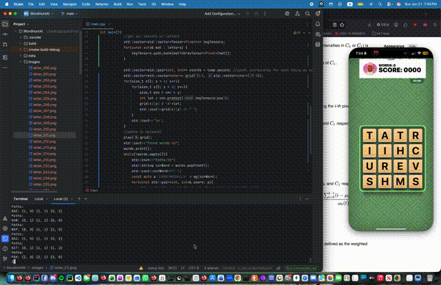

# WordHunt AI
 Are you tired of losing Word Hunt games to the Word Hunt Demons?
 
 Are you tired of getting laughed at by your homegirl after she gets 15k points on a word full of the letter Z
 
 Or are you just plain bad at Word Hunt?
 
 Well fear no longer. For now you will NEVER lose another WordHunt game again with WordHunt AI.

 

 Although there are many solvers out there that give all the words on a given Word Hunt Board, I've yet to come across a bot that truly solves Word Hunt. Here I've done exactly that. Built in C++ and Objective-C, this bot features a custom pipeline built upon a SGD CNN with cosine annealing learning rate scheduler. It was trained from scratch with the EMNIST dataset and then fine tuned with a custom dataset. This bot also includes an OpenCV pipeline for screen capture and letter recognition, a multithreaded backtracking solver that uses an optimized trie structure called a double-array trie (DAT) in order to not fry your ram (those prices are getting out of hand). 
 
 The Cherry on top?
 
 No PyTorch, No TensorFlow, No ONNX
 
 NO ML FRAMEWORKS THAT HAVE HUNDREDS OF STEPS TO COMPILE IN C++ REQUIRED SINCE THIS IS JUST PURE C++ HOORAY!!! 
 

 
---
Now lets get into some technical stuff! 
## Architecture
 
Oki so this bot runs in five stages:
 
```
A Word Hunt Game is initated via iPhone Mirroring + iMessage
        |
        v
 Screen Capture          ScreenCaptureKit here grabs a live game frame and we will use this to find the grid
        │
        v
 CV Pipeline             A custom image parcing algorithm isolates the 4×4 grid and extracts each letter tile
        │
        v
 CNN Inference           Then our CNN classifies each tile on the screen on the corresponding letter
        │
        v
 Solver Engine           A Multithreaded backtracking algorithm then finds all valid words using our already populated DAT (serialized and loaded for maximum efficency)
        │
        v
 Mouse Automation        We then loop across words and their respective paths and use a custom Objective-C function then sends input events to trace the best-scoring path
```
 
### Dependencies
- A MacBook.
- OpenCV 4 (`brew install opencv` to install)
### Compile (if you want to recompile it again for some reason)
 
```
clang++ main.cpp cv.cpp DAT.cpp engine.cpp appFocus.mm move.mm -std=c++23 -o main -O3 -march=native `pkg-config --cflags --libs opencv4` -framework ApplicationServices -framework CoreGraphics -framework CoreFoundation -framework AppKit -framework ScreenCaptureKit
I'll try to make this more simple with CMAKE but that was nightmare to try and learn </3
```
 
### Run
```
./main inside src/cpp folder
```
TO PROPERLY RUN MAKE SURE IPHONE MIRRORING IS RUNNING AND THE GAME IS STARTED BEFORE TYPING IN A NUMBER 1 TO BEGIN SOLVING/PLAYING. WILL CONTINUE RUNNING UNTIL -1 IS ENTERED SO JUST STOP THE MODEL BY TYPING -1
 
---
 
## Results
 
| Metric | Value |
|---|---|
| EMNIST validation accuracy | ~95.6% |
| Inference Time per Grid | < 5ms |
| Solve a full board | ~25-35 Seconds (Depends on number of words in the board. Limiting factor is mouse movement) |

---
 
## Technical Highlights (Full breakdown will be written up later [maybe])
 
- **No ML frameworks REQUIRED YAYAYAYAYAYAY NO COMPILE NONSENSE** — CNN, forward prop, and backprop were implemented with from ONLY calculus/LinAlg
- **Custom Tensor library** — Although my Tensor class `Tensor<T>` came from a different project it is completley custom with a chained `[]` indexing via `TensorProxy<T>` (just like normal vectors!), and recursive printing (python! yayay printing)
- **Parallelized training and inference** — Fully optimized parallel training and inference for max efficency! 
- **Double-array trie** — A optimized Trie that avoids pointer overhead that is present in most Trie implementations that use pointers to other trie objects
- **Cosine LR annealing** — Literature favorite learning rate schedule for SGD CNN's.
- **Custom FFT/IFFT/N Dimension FFT/IFFT Signal Processing Library for Convolution Operator** - Used for optimizing convolution from O(N^2) to O(NlogN) using -> conv(a,b) = IFFT(FFT(a) * fft(b)) 
